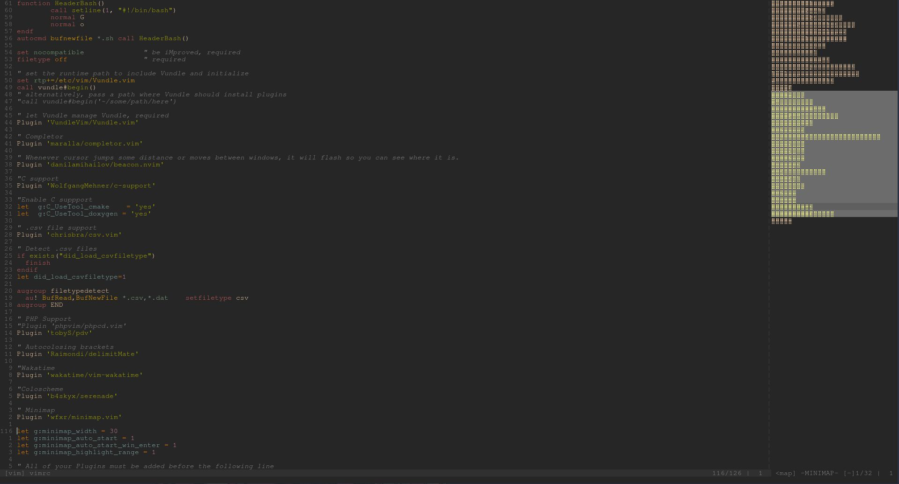

# Mirko's

```
      ██            ██     ████ ██  ██
     ░██           ░██    ░██░ ░░  ░██
     ░██  ██████  ██████ ██████ ██ ░██  █████   ██████
  ██████ ██░░░░██░░░██░ ░░░██░ ░██ ░██ ██░░░██ ██░░░░
 ██░░░██░██   ░██  ░██    ░██  ░██ ░██░███████░░█████
░██  ░██░██   ░██  ░██    ░██  ░██ ░██░██░░░░  ░░░░░██
░░██████░░██████   ░░██   ░██  ░██ ███░░██████ ██████
 ░░░░░░  ░░░░░░     ░░    ░░   ░░ ░░░  ░░░░░░ ░░░░░░
```


- [Alacritty config](./.config/alacritty/alacritty.yml)
- [Bash Config](./.bashrc)
- [Bat config](./.config/bat/config)
- [Bpytop Config](./.config/bpytop/bpytop.conf)
- [Neofetch Config](./.config/neofetch/config.conf)
- [Pacman config](./etc/pacman.conf)
- [Tmux config](./.config/tmux/tmux.conf)
- [Topgrade config](./.config/topgrade.toml)
- [Vim Config](./etc/vimrc)
  
  

- [Zsh config](./.zshrc)
