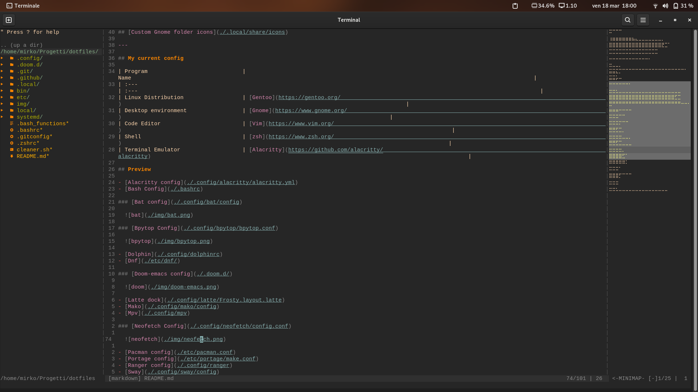

# Mirko's

```
      ██            ██     ████ ██  ██
     ░██           ░██    ░██░ ░░  ░██
     ░██  ██████  ██████ ██████ ██ ░██  █████   ██████
  ██████ ██░░░░██░░░██░ ░░░██░ ░██ ░██ ██░░░██ ██░░░░
 ██░░░██░██   ░██  ░██    ░██  ░██ ░██░███████░░█████
░██  ░██░██   ░██  ░██    ░██  ░██ ░██░██░░░░  ░░░░░██
░░██████░░██████   ░░██   ░██  ░██ ███░░██████ ██████
 ░░░░░░  ░░░░░░     ░░    ░░   ░░ ░░░  ░░░░░░ ░░░░░░
```


- [Alacritty config](./.config/alacritty/alacritty.yml)
- [Bash Config](./.bashrc)
- [Bat config](./.config/bat/config)

  

- [Bpytop Config](./.config/bpytop/bpytop.conf)

  

- [Doom-emacs config](./.doom.d/)

  

- [Mako](./.config/mako/config)

- [Neofetch Config](./.config/neofetch/config.conf)

  

- [Pacman config](./etc/pacman.conf)
- [Sway](./.config/sway/config)
- [Swaylock](./.config/swaylock/config)
- [Starship config](./.config/starship.toml)
- [Tmux config](./.config/tmux/tmux.conf)
- [Topgrade config](./.config/topgrade.toml)
- [Vim Config](./etc/vimrc)
  
  

- [Wallpapers](./wallpapers/)
- [Waybar](./.config/waybar)
- [Wofi](./.config/wofi)
- [Zsh config](./.zshrc)

  

## 💲Support my work

[](https://paypal.me/stupidamentepod)

