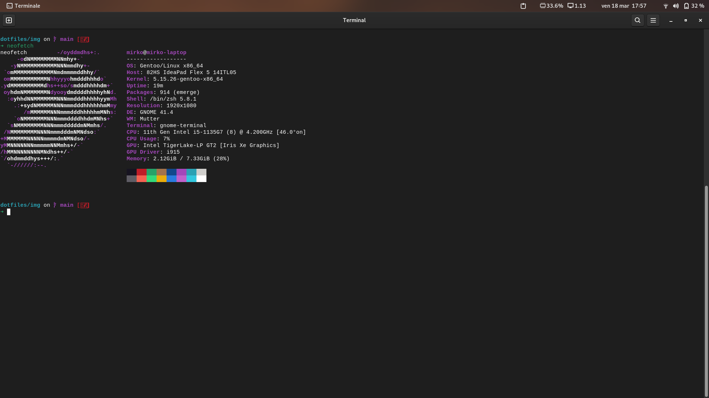

# Mirko's

```
      ██            ██     ████ ██  ██
     ░██           ░██    ░██░ ░░  ░██
     ░██  ██████  ██████ ██████ ██ ░██  █████   ██████
  ██████ ██░░░░██░░░██░ ░░░██░ ░██ ░██ ██░░░██ ██░░░░
 ██░░░██░██   ░██  ░██    ░██  ░██ ░██░███████░░█████
░██  ░██░██   ░██  ░██    ░██  ░██ ░██░██░░░░  ░░░░░██
░░██████░░██████   ░░██   ░██  ░██ ███░░██████ ██████
 ░░░░░░  ░░░░░░     ░░    ░░   ░░ ░░░  ░░░░░░ ░░░░░░
```


---

These are the dots I use on my linux machine. I update my setup according to my feels and needs.

---
## Other

## pen disable touchscreen :
Contains a script and a service (which must be enabled of course) for disabling the touchscreen when the Surface Pen is hovering on the screen. Useful for improved palm rejection.

## pen-disable touch :
Disable touch when usign pen 
in bin/ and systemd/

## [cleaner.sh](./cleaner.sh) :
system cleaner script

## [Custom Gnome folder icons](./.local/share/icons)

---

## My current config

| Program                             | Name                                                                                                                           |
| :---                                | :---                                                                                                                           |
| Linux Distribution                  | [Gentoo](https://gentoo.org/)                                                                                       |
| Desktop environment                 | [Gnome](https://www.gnome.org/)                                                                                  |
| Code Editor                         | [Vim](https://www.vim.org/)                                                                                                     |
| Shell                               | [zsh](https://www.zsh.org/)                                                                                                    |
| Terminal Emulator                   | [Alacritty](https://github.com/alacritty/alacritty)                                                                                                 |

## Preview

- [Alacritty config](./.config/alacritty/alacritty.yml)
- [Bash Config](./.bashrc)

### [Bat config](./.config/bat/config)

  

### [Bpytop Config](./.config/bpytop/bpytop.conf)

  

- [Dolphin](./.config/dolphinrc)
- [Dnf](./etc/dnf/)

### [Doom-emacs config](./.doom.d/)

  

- [Latte dock](./.config/latte/Frosty.layout.latte)
- [Mako](./.config/mako/config)
- [Mpv](./.config/mpv)

### [Neofetch Config](./.config/neofetch/config.conf)

  

- [Pacman config](./etc/pacman.conf)
- [Portage config](./etc/portage/make.conf)
- [Ranger config](./.config/ranger)
- [Sway](./.config/sway/config)
- [Swaylock](./.config/swaylock/config)
- [Starship config](./.config/starship.toml)
- [Tmux config](./.config/tmux/tmux.conf)
- [Topgrade config](./.config/topgrade.toml)

### [Vim Config](./etc/vimrc)
  
  

- [Wallpapers](https://github.com/Mirko-r/Wallpapers)
- [Waybar](./.config/waybar)
- [Wofi](./.config/wofi)
- [Zathura](./.config/zathura)

### [Zsh config](./.zshrc)

  

## 💲Support my work

[](https://paypal.me/stupidamentepod)

